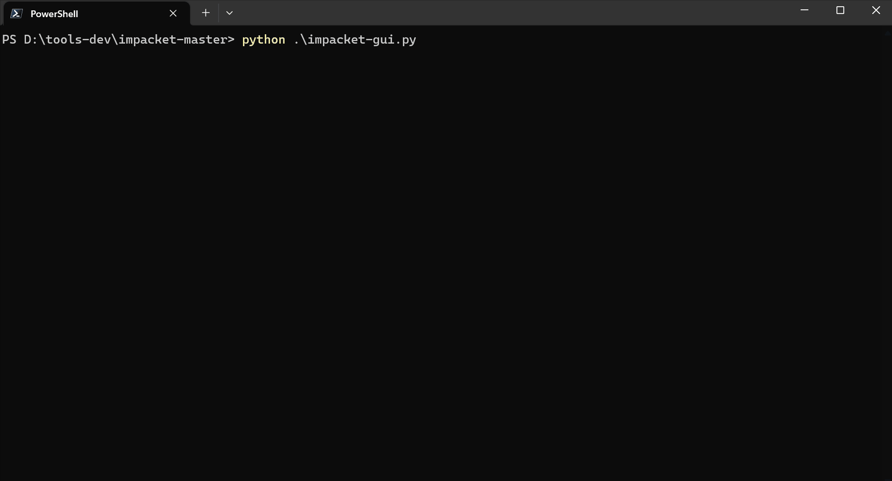
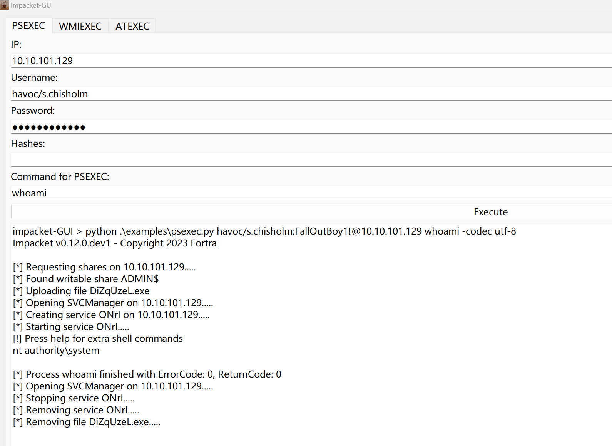
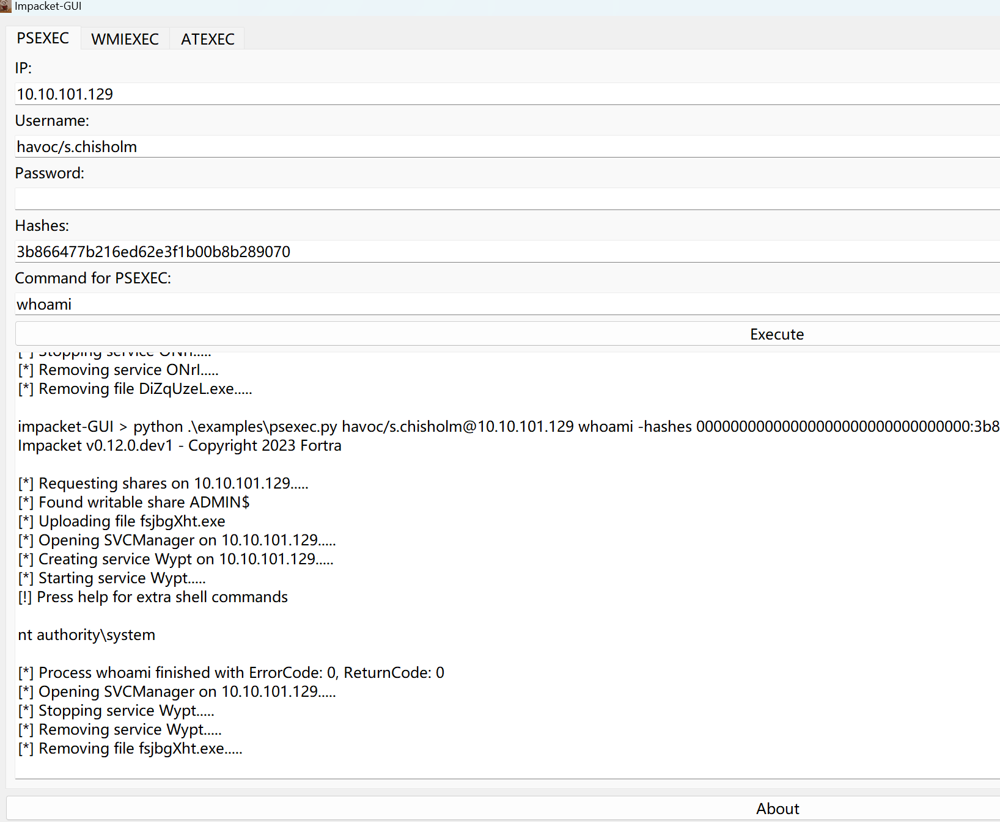
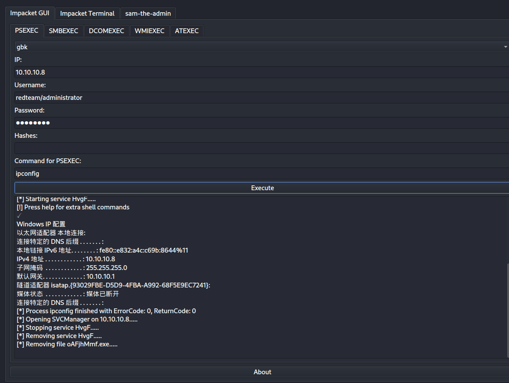
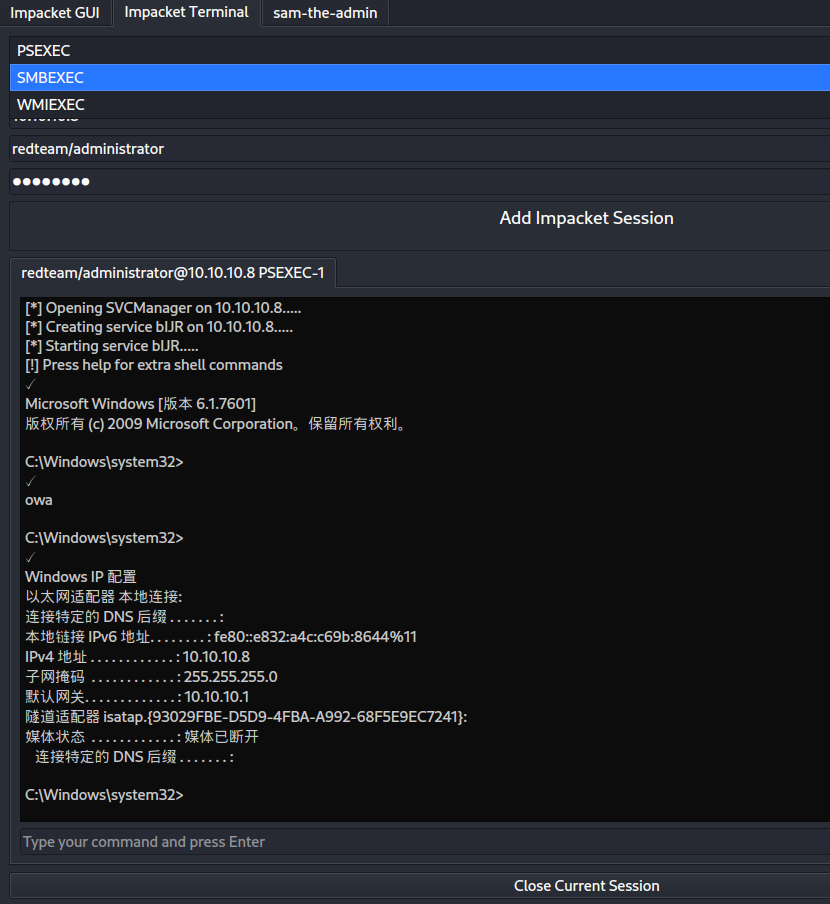
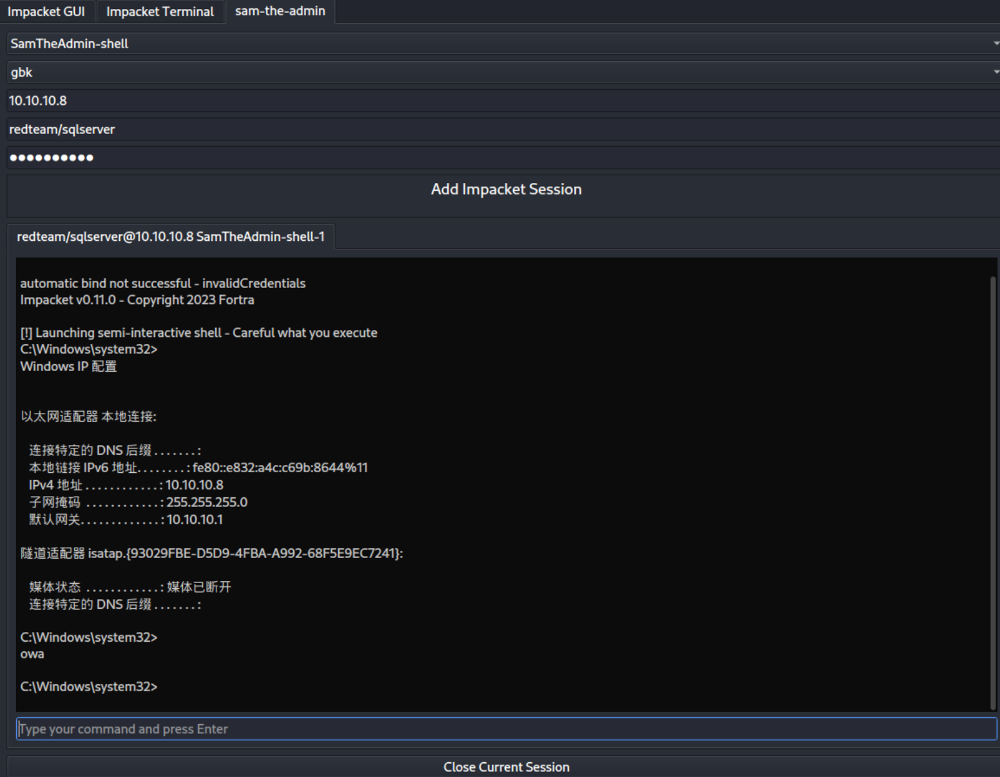
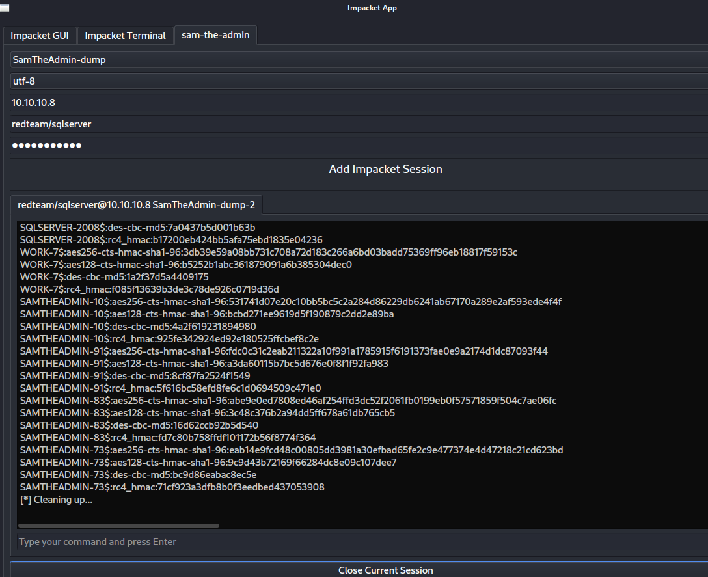

# impacket-gui


目前仅在 linux 下做过测试，有 bug 提issue 

对目标是中文操作系统，请选择 gbk 编码

# 功能列表

- psexec 密码与哈希单次命令执行
- smbexec 密码与哈希单次命令执行
- dcomexec 密码与哈希单次命令执行
- wimexec 密码与哈希单次命令执行
- psexec 交互式执行
- smbexec 交互式执行
- dcomexec 交互式执行
- sam-the-admin shell 方式
- sam-the-admin dump 方式


# 使用方式

1.下载impacket

```
git https://github.com/fortra/impacket.git

pip install -r requirements.txt
```

2.下载本项目
```
git https://github.com/yutianqaq/impacket-gui.git
```

3.安装 Pyqt 等依赖

4.运行
PSEXEC 密码与哈希演示 gif

PSEXEC 密码

PSEXEC 哈希


# 功能列表
## psexec、smbexec、dcomexec、wmiexec、atexec 的单次命令执行



## psexec、smbexec、wmiexec 的交互式命令执行




## 一个获取域控的利用模块

来源于 https://github.com/WazeHell/sam-the-admin

需要填写域控 IP 一个域内账号，对于中文操作系统加了 gbk 解码

### 获取交互式shell



### 获取哈希



# 更新

2023年9月2日：

- 增加 ui 界面 
- 增加兼容性以显示中文

- 增加smbexec、dcomexec 的单次命令执行

- 增加 psexec、smbexec、wmiexec 交互式 shell
- 增加一个获取域控的利用方式
